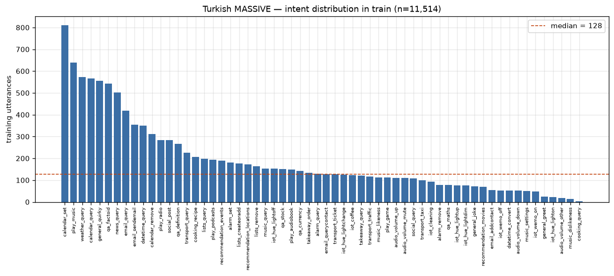
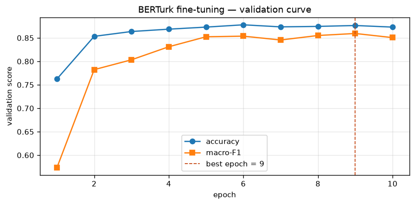
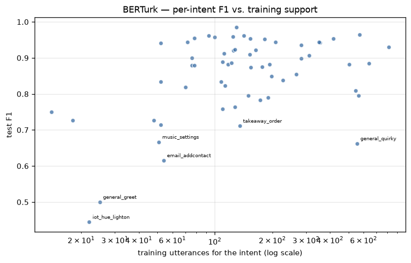
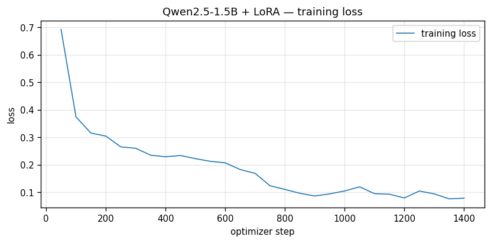

# Turkish Intent Classification: LLM Fine-Tuning vs. Classical Baselines

Intent classification for Turkish voice-assistant commands on the **tr-TR** portion of
[Amazon MASSIVE](https://github.com/alexa/massive), comparing a LoRA-fine-tuned
instruction LLM against a fine-tuned Turkish BERT encoder and a zero-shot prompting
baseline.

[](LICENSE)
[](https://www.python.org/)

The question this repo answers: **for a 60-class Turkish intent task with ~11.5k training
examples, is a parameter-efficient fine-tuned 1.5B LLM actually better than a 110M encoder
that was pretrained on Turkish?**

**No.** BERTurk wins on macro-F1 by 1.2 points, having trained in under half the time on a
laptop GPU rather than 100 minutes on a T4, and it classifies in one forward pass instead of
generating tokens. LoRA closes almost all of the enormous gap from zero-shot — but it closes
it to just under the encoder, not past it.

Every number below comes from a run in this repository; nothing is quoted from a paper.

## Results

All models are evaluated on the official MASSIVE tr-TR **test** split (2,974 utterances).

| Experiment | Model | Trainable params | Accuracy | Macro-F1 |
|---|---|---:|---:|---:|
| Zero-shot prompting | Qwen2.5-1.5B-Instruct | 0 | 0.4526 | 0.4049 |
| LoRA SFT | Qwen2.5-1.5B-Instruct + LoRA | 18,464,768 | 0.8615 | 0.8383 |
| **Classical fine-tune** | **BERTurk (`dbmdz/bert-base-turkish-cased`)** | 110,663,484 | **0.8773** | **0.8501** |

What that costs, which the scores alone do not show:

| | BERTurk | Qwen + LoRA |
|---|---:|---:|
| Total parameters | 110M | 1,562M |
| Training time | 45.5 min (Apple MPS, fp32) | 101.9 min (T4, fp16) |
| Test-set inference | single forward pass | 5.1 min of generation |
| Artefact to ship | 423 MB model | 3.1 GB base + 74 MB adapter |

**Macro-F1 convention.** `cooking_query` has no test utterances at all (see
[Label coverage](#label-coverage)), so macro-F1 is averaged over the **59 intents present
in the test split**. The 60-label average is also recorded in each results JSON so the
numbers can be compared against work that uses the other convention.

## Dataset

[MASSIVE](https://arxiv.org/abs/2204.08582) (FitzGerald et al., 2022) is a 1M-example
multilingual NLU dataset covering 51 locales. We use `tr-TR` with its **published splits**,
unmodified — no re-splitting, so results stay comparable with other work.

| Split | Utterances | Intents present |
|---|---:|---:|
| train | 11,514 | 60 |
| validation | 2,033 | 59 |
| test | 2,974 | 59 |
| **total** | **16,521** | **60** |

60 intents across 18 scenarios. The loader pulls the official Amazon tarball and verifies
its SHA-256 before use.

> **Why not `load_dataset("AmazonScience/massive", "tr-TR")`?** That Hugging Face repository
> is a script-based dataset, and `datasets>=3.0` refuses to execute dataset scripts — the
> load fails outright on a current Colab runtime. `src/data.py` reads the canonical Amazon
> S3 tarball instead, which also gives us the slot annotations and per-annotator quality
> judgments that the third-party parquet mirrors drop.

### Label imbalance



| | |
|---|---:|
| Largest intent (`calendar_set`) | 810 train utterances |
| Smallest intent (`cooking_query`) | 4 train utterances |
| Median intent | 128.5 train utterances |
| Imbalance ratio (max / min) | 202.5× |
| Intents with < 100 train utterances | 18 of 60 |
| Intents with < 50 train utterances | 6 of 60 |

A model that ignored the entire tail could still post a respectable accuracy, which is why
macro-F1 is the headline metric throughout.

### Label coverage

Two intents are not present in every split:

| Intent | train | validation | test |
|---|---:|---:|---:|
| `audio_volume_other` | 18 | 0 | 6 |
| `cooking_query` | 4 | 2 | 0 |

`cooking_query` has six examples in the entire Turkish corpus and none in test. Passing all
60 labels to scikit-learn would score that class 0.0 and depress macro-F1 by roughly 1/60
for reasons that have nothing to do with the model — hence the convention stated above.

## Turkish-specific findings

MASSIVE is a **parallel** corpus: each utterance id carries the same intent and the same
split in all 51 locales. Holding meaning constant lets us measure what changes when the
language changes, across all 16,521 Turkish/English utterance pairs.

| | Turkish | English | ratio |
|---|---:|---:|---:|
| Mean words per utterance | 5.48 | 6.90 | 0.79 |
| Mean characters per word | 6.38 | 5.06 | 1.26 |

Turkish expresses the same command in **21% fewer words**, each **26% longer**: grammatical
information that English spreads across separate function words is suffixed onto the stem.
A word-level feature space fragments badly under that morphology, which is why the classical
baseline here is a subword model rather than bag-of-words.

Utterances are also short — 5.48 words on average, and **22% are three words or fewer** —
so there is little context to fall back on when the morphology is ambiguous.

**Orthography.** 90.0% of utterances contain at least one of `ç ğ ı ö ş ü`, and stripping
diacritics never collides with another utterance in the corpus. MASSIVE's Turkish was
produced by paid translators, so it is orthographically clean in a way that real typed
Turkish is not: a model trained here never sees `yarin sabah alarm kur` for `yarın sabah
alarm kur`. Robustness to ASCII-folded input is therefore probed deliberately in the error
analysis rather than assumed to be covered by the test score.

**Intrinsic ambiguity.** 36 distinct utterances (106 rows, 0.64% of the corpus) appear under
more than one intent — `general_greet` vs `general_quirky`, `audio_volume_down` vs
`audio_volume_mute`, `iot_hue_lighton` vs `iot_hue_lightup`, and others. No model can
separate these from text alone, so they bound achievable accuracy and are the first place to
look when reading a confusion matrix.

## BERTurk baseline

A full fine-tune of all 110,663,484 parameters, 10 epochs, sequence length 32 (which
truncates nothing — the longest training utterance is 31 WordPiece tokens). Checkpoint
selection is on validation macro-F1.

| | Test |
|---|---:|
| Accuracy | 0.8773 |
| Macro-F1 (59 intents present) | 0.8501 |
| Macro-F1 (all 60 labels) | 0.8359 |
| Weighted F1 | 0.8773 |

The 0.0142 gap between the two macro-F1 numbers is exactly `0.8501 / 60` — the arithmetic
cost of averaging in one class that has no test examples. It says nothing about the model,
which is why the convention has to be published rather than left implicit.

### Selecting on macro-F1 instead of loss is worth 5.6 points



Validation loss bottoms out at **epoch 3** (0.5423) and rises monotonically afterwards, to
0.6519 by epoch 10. Validation macro-F1 does the opposite — it keeps climbing and peaks at
**epoch 9** (0.8595).

The two signals disagree because they measure different things. As training continues the
model grows more confident on the head classes it already gets right, which inflates
cross-entropy on the examples it gets wrong, while it is still slowly learning the tail.
Early stopping on validation loss would have halted at epoch 3 and shipped a model scoring
**0.8034** macro-F1; selecting on macro-F1 gives **0.8595**. Same run, same data, 5.6 points
of difference from the stopping rule alone.

### Where the errors are



| Intent group | Count | Mean test F1 |
|---|---:|---:|
| Fewer than 100 training utterances | 17 | 0.7799 |
| 100 or more training utterances | 42 | 0.8785 |

The ten-point gap is the whole reason macro-F1 is the headline metric: accuracy, which the
head classes dominate, hides it completely.

The one large intent that performs badly is `general_quirky` (555 training utterances, test
F1 0.6624) — visible as the lone outlier on the right of the plot. It is not starved of
data; it is MASSIVE's catch-all class for anything conversational, so it overlaps with
whatever else the utterance resembles. It accounts for the three most frequent confusions:

| Count | Gold | Predicted |
|---:|---|---|
| 16 | `general_quirky` | `qa_factoid` |
| 10 | `calendar_set` | `calendar_query` |
| 9 | `general_quirky` | `calendar_query` |
| 8 | `calendar_query` | `calendar_set` |
| 7 | `general_quirky` | `news_query` |
| 7 | `qa_factoid` | `general_quirky` |

The `general_quirky` ↔ `qa_factoid` and `calendar_set` ↔ `calendar_query` pairs were both
flagged as intrinsically ambiguous in notebook 01, before any model was trained — the
classifier is failing on the boundaries the data itself does not draw cleanly.

### Tokenization

BERTurk needs **1.299 WordPiece tokens per whitespace word** on the Turkish training set
(82,173 subwords for 63,263 words). Notebook 05 compares this against a multilingual
tokenizer on the same utterances, to separate "the model is small" from "the vocabulary
shreds Turkish morphology".

### Reproduction note

These numbers come from a run on Apple M-series MPS in **fp32**, taking 45.5 minutes. On a
Colab T4 the notebook switches to fp16 automatically (`USE_FP16` follows `cuda_available`,
and T4 gains nothing from bf16). The full environment is recorded in `results/berturk.json`, so a
re-run on different hardware is comparable rather than confusing.

## Zero-shot baseline

Qwen2.5-1.5B-Instruct, no training, prompted with all 60 intent names and asked to return
one. Greedy decoding. The prompt was checked on a 200-utterance validation sample and frozen
before the test set was touched.

| | Test |
|---|---:|
| Accuracy | 0.4526 |
| Macro-F1 (59 intents present) | 0.4049 |
| Macro-F1 (all 60 labels) | 0.3982 |
| Weighted F1 | 0.4448 |

The frozen prompt scored 0.4550 on the validation sample and 0.4526 on test, so the
held-out estimate was honest — nothing was tuned into the test number.

This is **less than half** of what the 110M BERTurk encoder achieves on macro-F1 (0.8501).
Zero-shot prompting of a general instruction model is not competitive on this task, and the
reasons are specific rather than vague.

### It invents labels that do not exist

101 of 2,974 predictions (3.4%) were not valid intent names, even though the full inventory
was in the prompt. The model composed plausible-looking labels out of the morphology of the
real ones — `transport_radio`, `audio_volume_off`, `iot_hue_lightclean`, `qa_math`,
`sports_score`. Counting distinct output strings gives **123 against a label space of 60**.

These are recorded rather than repaired: `src/prompting.py` accepts punctuation, casing and
a trailing gloss, but never digs a label out of a sentence or snaps a near-miss onto the
closest real name. Lenient matching would have quietly converted a model failure into a
parsing convenience.

### It does not know where the taxonomy draws its lines

The single most revealing error: the model predicted `cooking_query` **53 times**, and every
one was wrong — that intent has no test utterances at all.

| What it actually was | Times predicted as `cooking_query` |
|---|---:|
| `cooking_recipe` | 15 |
| `iot_coffee` | 9 |
| `takeaway_order` | 4 |
| `takeaway_query` | 4 |
| `weather_query` | 4 |

Given *"bu gece akşam yemeği için sushi söyler misin"* ("order sushi for dinner tonight"),
the model reasons semantically — this is about food, so it is a cooking query. MASSIVE
splits food across `cooking_recipe`, `takeaway_order` and `iot_coffee`, and nothing in a
list of label names says where those borders run. That knowledge lives in the training data,
which is exactly what the zero-shot setting withholds.

The same failure shows up as systematic over-prediction of broad-sounding labels:

| Intent | Predicted | Actually occurs |
|---|---:|---:|
| `music_query` | 140 | 35 |
| `recommendation_events` | 100 | 43 |
| `alarm_set` | 96 | 41 |

A label inventory tells the model what the classes are called. It does not tell it what they
mean, and on a 60-way taxonomy with overlapping semantics, the names are not enough.

### It gets the domain right and the operation wrong

The most frequent confusions are not random. In almost every one the model lands in the
correct domain and then picks the wrong verb:

| Count | Gold | Predicted |
|---:|---|---|
| 79 | `play_music` | `music_query` |
| 45 | `calendar_query` | `calendar_set` |
| 30 | `qa_factoid` | `weather_query` |
| 27 | `general_quirky` | `general_joke` |
| 27 | `email_query` | `email_querycontact` |
| 24 | `play_music` | `play_podcasts` |

Play versus query, read versus create, contact versus message — the model understands what
the Turkish utterance is *about* and fails on which operation the taxonomy assigns it to.
That distinction matters for the comparison that follows: the deficit LoRA has to close is
not Turkish comprehension, it is knowledge of a label scheme that only exists in the
training data.

Three intents score exactly 0: `iot_wemo_off` (18 test utterances), `iot_wemo_on` (10) and
`general_greet` (1). `general_quirky` — MASSIVE's catch-all, and the intent BERTurk also
struggled with — collapses almost completely, with 3 of its 169 test utterances recovered
(F1 0.0330).

For reference, decoding all 2,974 test utterances took **3.3 minutes** on the T4 at batch 16,
plus 41 seconds to load the model. The cost of this baseline is the prompt, not the compute.

## LoRA fine-tuning

Same model as the zero-shot baseline, same prompt, 2 epochs of supervised fine-tuning on
the 11,514 training utterances. LoRA rank 16, alpha 32, adapters on all seven attention and
MLP projections: **18,464,768 trainable parameters, 1.18% of the model**. Loss is computed
on the intent tokens only — 99% of each 301-token sequence is the shared prompt, and
supervising it would spend the run learning boilerplate.

| | Test |
|---|---:|
| Accuracy | 0.8615 |
| Macro-F1 (59 intents present) | 0.8383 |
| Macro-F1 (all 60 labels) | 0.8243 |
| Weighted F1 | 0.8611 |



Validation loss improved through both epochs, 0.2013 to 0.1575, so this is not a run that
stopped early for want of capacity.

### Fine-tuning fixed exactly what zero-shot got wrong

Comparing the two runs utterance by utterance — same model, same prompt, only the weights
differ:

| | Count |
|---|---:|
| Zero-shot wrong → LoRA right | 1,267 |
| Zero-shot right → LoRA wrong | 51 |
| **Net corrections** | **+1,216** |

The specific failures named in the zero-shot section are gone. Invented labels drop from
**101 to 2**. The domain-right/operation-wrong confusions collapse:

| Gold → Predicted | Zero-shot | LoRA |
|---|---:|---:|
| `play_music` → `music_query` | 79 | 2 |
| `calendar_query` → `calendar_set` | 45 | 8 |
| `email_query` → `email_querycontact` | 27 | 0 |
| `play_music` → `play_podcasts` | 24 | 0 |

This is the clearest result in the project. The zero-shot model already understood the
Turkish; what it lacked was the taxonomy, and 18.5M adapter parameters were enough to
install it.

### What neither model fixes

361 test utterances (12.1%) are wrong under both. LoRA's remaining errors are no longer
about operations — they are concentrated in `general_quirky`, MASSIVE's catch-all class,
and in the pairs notebook 01 flagged as intrinsically ambiguous *before any model was
trained*: `general_quirky` ↔ `qa_factoid` (22 + 7), `calendar_set` ↔ `calendar_query`
(9 + 8).

`general_quirky` is where the two fine-tuned models separate:

| Model | `general_quirky` F1 |
|---|---:|
| Zero-shot | 0.0330 |
| Qwen + LoRA | 0.5316 |
| BERTurk | 0.6624 |

Both are also weaker on rare intents, and again BERTurk holds up slightly better:

| Intent group | BERTurk | Qwen + LoRA |
|---|---:|---:|
| Fewer than 100 training utterances (17) | 0.7799 | 0.7586 |
| 100 or more (42) | 0.8785 | 0.8706 |

### Reading the result

The encoder wins on every axis that matters for deployment: macro-F1, training time,
inference cost, and the size of the thing you have to ship. For a fixed 60-class inventory
with 11.5k labelled examples, a Turkish-pretrained encoder remains the right tool, and the
1.5B generative model is paying for flexibility this task does not use.

The LLM's case is narrower but real. It trains **six times fewer parameters** than BERTurk
(18.5M against 110.7M) and ships a 74 MB adapter, so one base model could serve several
tasks through swappable adapters. It also needs no fixed label space at inference — the
scaffolding is a prompt, not a classification head. Neither advantage is worth 1.2 points of
macro-F1 here, but both would matter for a system carrying many intents that change over
time.

## Experiments

| # | Notebook | What it does |
|---|---|---|
| 01 | [`01_data_exploration.ipynb`](notebooks/01_data_exploration.ipynb) | Splits, label imbalance, length statistics, Turkish-specific analysis. **Done.** |
| 02 | [`02_baseline_berturk.ipynb`](notebooks/02_baseline_berturk.ipynb) | Fine-tune `dbmdz/bert-base-turkish-cased` for 60-way classification. **Done.** |
| 03 | [`03_zeroshot_qwen.ipynb`](notebooks/03_zeroshot_qwen.ipynb) | Qwen2.5-1.5B-Instruct prompted with the full intent inventory, no training. **Done.** |
| 04 | [`04_lora_qwen.ipynb`](notebooks/04_lora_qwen.ipynb) | Qwen2.5-1.5B-Instruct + LoRA, supervised fine-tuning to emit the intent label. **Done.** |
| 05 | `05_error_analysis.ipynb` | Where the two fine-tuned models disagree, and robustness to ASCII-folded Turkish. *Planned.* |

All three experiments are complete; notebook 05 goes deeper into the errors that remain.

Every notebook runs end to end on a free Google Colab **T4**. Mixed precision is fp16
throughout: the T4 is Turing (compute capability 7.5), and although PyTorch reports bf16
as supported there, it is emulated rather than executed on the tensor cores — native bf16
begins at Ampere. Each results file records the capability alongside both bf16 flags, so
the choice can be checked rather than taken on trust.

Notebooks 01 and 02 also run on a laptop — the BERTurk numbers above came from an Apple
MPS run. Notebooks 03 and 04 need the GPU. The 1.5B model is 3.08 GB in fp16 before any
activations, and on a machine with 8 GB of unified memory that is enough to push generation
into swap, where throughput drops roughly tenfold. Batch sizes are read from the config per
device (`batch_size` vs `batch_size_cuda`) rather than hard-coded, because the right value
differs by an order of magnitude between the two.

## Reproducing

Each notebook opens directly in Colab and clones this repository as its first cell — nothing
else to set up.

Locally:

```bash
git clone https://github.com/alper4n/turkish-intent-llm.git
cd turkish-intent-llm
python -m venv .venv && source .venv/bin/activate
pip install -r requirements.txt
jupyter lab notebooks/
```

The exploration notebook needs only pandas, numpy, matplotlib and pyyaml; the modelling
notebooks need the rest.

Reproducibility is enforced by a fixed seed (42, set in `configs/data.yaml` and applied
through `src.utils.set_seed`), the published dataset splits used as-is, and a SHA-256 check
on the downloaded archive. Every metric is written to `results/` as JSON with a timestamp
and the runtime environment, and the tables in this README are transcribed from those files.

## Repository layout

```
configs/      YAML configs — seed, dataset, per-experiment hyperparameters
notebooks/    One notebook per experiment, Colab-ready
src/          Reusable code: data loading, metrics, prompting, training helpers
results/      Metrics as JSON + figures; the source of every number in this README
```

## Data licence and citation

MASSIVE is released by Amazon under **CC BY 4.0**. If you use it, cite:

```bibtex
@inproceedings{fitzgerald-etal-2023-massive,
  title     = {{MASSIVE}: A 1{M}-Example Multilingual Natural Language Understanding
               Dataset with 51 Typologically-Diverse Languages},
  author    = {FitzGerald, Jack and Hench, Christopher and Peris, Charith and
               Mackie, Scott and Rottmann, Kay and Sanchez, Ana and Nash, Aaron and
               Urbach, Liam and Kakarala, Vishesh and Singh, Richa and
               Ranganath, Swetha and Crist, Laurie and Britan, Misha and
               Leeuwis, Wouter and Tur, Gokhan and Natarajan, Prem},
  booktitle = {Proceedings of the 61st Annual Meeting of the Association for
               Computational Linguistics},
  year      = {2023},
  url       = {https://aclanthology.org/2023.acl-long.235}
}
```

The code in this repository is MIT licensed — see [LICENSE](LICENSE).
